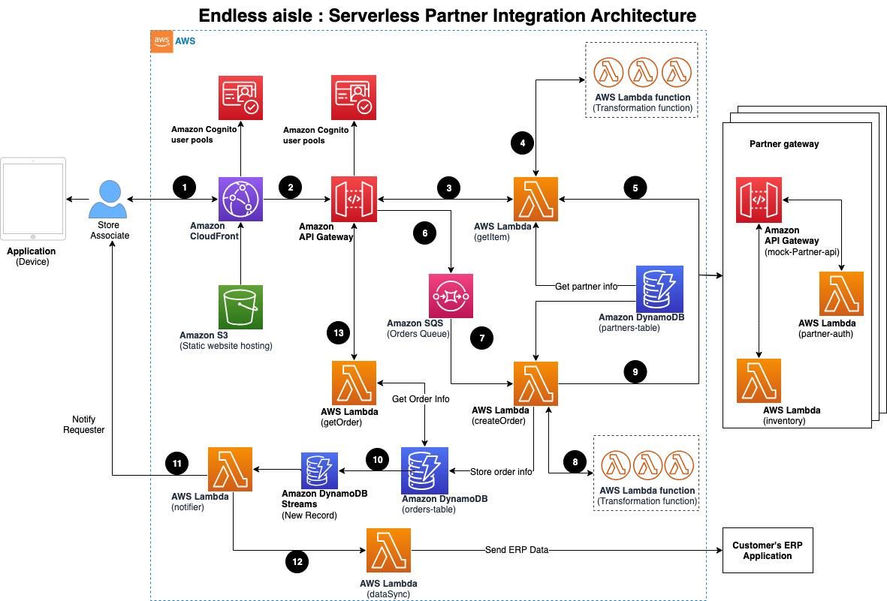

# serveless-partner-integration-endless-aisle

This CDK constructs provides sample serverless solution for multiple partner integration. 

This AWS CDK application that provides a sample to create `Endless Aisle` solution for an e-commerce company. `Endless Aisle` is an alternative solution to meet customer’s demand. It models as drop-shipping i.e. fulfilling the order through automated integration with the product or reseller partners. Such automation would result in customer’s ability to place the order on a tablet or kiosk when they do not find a specific product of their choice. It allows businesses to no longer keep stock products more than the shelf inventory and still the end customer can place an order and get it shipped at their home.

The `cdk.json` file tells the CDK Toolkit how to execute your app.


# Build Endless Aisle serverless architecture using AWS CloudFront, AWS S3, Amazon API Gateway, Amazon SQS and AWS Lambda	
<!--BEGIN STABILITY BANNER-->
---


> **This is an experimental example. It may not build out of the box**
>
> This example is built using Construct Libraries marked "Experimental" and may not be updated for latest breaking changes.
>
> If build is unsuccessful, please create an [issue](TBA) so that we may debug the problem 

---
<!--END STABILITY BANNER-->
| **Language**     |
|:-------------|
| Typescript|


## Build
To install and build the latest code in `serveless-partner-integration-endless-aisle/infrastructure` , `serveless-partner-integration-endless-aisle/infrastructure/lib/lambda` and `serveless-partner-integration-endless-aisle/website` folders:

1. First we wil install aws-cdk library locally.
```bash
npm install -g aws-cdk
```

2. We will build website package to generate deployable website static content.

```bash
cd serveless-partner-integration-endless-aisle/website
npm install
npm run build
```

3. Here we will install required packages for our Lambda code.

```bash
cd ../infrastructure/lib/lambda
npm install
```

4. We will build Infrastructure package to create deployable assets which will be used in cloudfromation template. 

```bash

cd serveless-partner-integration-endless-aisle/infrastructure
npm install
npm run build
```

## Synthesize Cloudformation Template

To see the Cloudformation template generated by the CDK, run `cdk synth` in the project folder, then check the output file in the "cdk.out" directory.

- Optional : 
    - If store wants to get updates about customer orders, they can set SENDER_EMAIL value with store email. You will receive verification email in this account, after which SES can send you order updates.
```bash
  export SENDER_EMAIL= dummytest@someemail.com
```


```bash

cd serveless-partner-integration-endless-aisle/infrastructure

cdk synth
```

## Deploy

Run `cdk deploy`. This will deploy / redeploy your Stack to your AWS Account.

1. Infrastruct
```bash
cdk deploy InfrastructureStack
```

2. Gather APIEndpoint, Cognito USER_POOL_ID, Cognito userpool USER_POOL_CLIENT_ID, AWS_REGION and update it in `.env` file.

```bash
REACT_APP_API_URL=
REACT_APP_USER_POOL_ID=
REACT_APP_USER_POOL_CLIENT_ID=
REACT_APP_AWS_REGION=
```

3. Infrastruct
```bash
cdk deploy WebsiteStack
```

## Testing

After the deployment CDK will output the API Gateway URL endpoint to be used for testing.

- Launch URL 


## Clean up

Run `cdk destroy --all`. This will delete the Infrastructure and Website stack created in your AWS Account.

```bash
cdk destroy --all
```

## Architecture




## Default settings

Out of the box implementation of the Construct without any override will set the following defaults:

#### Amazon API Gateway
- Deploy an edge-optimized API endpoint
- Enable CloudWatch logging for API Gateway
- Configure least privilege access IAM role for API Gateway
- Set the default authorizationType for all API methods to IAM
- Enable X-Ray Tracing

#### Amazon DynamoDB Table
- Set the billing mode for DynamoDB Table to On-Demand (Pay per request)
- Enable server-side encryption for DynamoDB Table using AWS managed KMS Key
- Creates a partition key called 'id' for DynamoDB Table
- Retain the Table when deleting the CloudFormation stack
- Enable continuous backups and point-in-time recovery

#### Amazon S3 Bucket
- Configure Access logging for Amazon S3 Bucket
- Enable server-side encryption for Amazon S3 Bucket using AWS managed KMS Key
- Enforce encryption of data in transit
- Turn on the versioning for Amazon S3 Bucket
- Don't allow public access for Amazon S3 Bucket
- Retain the Amazon S3 Bucket when deleting the CloudFormation stack
- Applies Lifecycle rule to move non-current object versions to Glacier storage after 90 days

#### AWS Lambda Function
- Configure limited privilege access IAM role for AWS Lambda function
- Enable X-Ray Tracing
- Set Environment Variables
- AWS_NODEJS_CONNECTION_REUSE_ENABLED (for Node 18.x and higher functions)

### Amazon CloudFront
- Configure Access logging for CloudFront Distribution
- Enable automatic injection of best practice HTTP security headers in all responses from CloudFront Distribution
- CloudFront originPath set to `'/'`

### AWS WAF
- Deploy a WAF web ACL with 7 AWS managed rule groups.
```bash  
    AWSManagedRulesBotControlRuleSet
    AWSManagedRulesKnownBadInputsRuleSet
    AWSManagedRulesCommonRuleSet
    AWSManagedRulesAnonymousIpList
    AWSManagedRulesAmazonIpReputationList
    AWSManagedRulesAdminProtectionRuleSet
    AWSManagedRulesSQLiRuleSet
```

### Amazon Cognito
- Set password policy for User Pools
- Enforce the advanced security mode for User Pools

### Amazon SQS Queue
- Deploy SQS dead-letter queue for the source SQS Queue
- Enable server-side encryption for source SQS Queue using AWS Managed KMS Key
- Enforce encryption of data in transit


## Useful commands

* `npm run build`   compile typescript to js
* `npm run watch`   watch for changes and compile
* `npm run test`    perform the jest unit tests
* `cdk deploy`      deploy this stack to your default AWS account/region
* `cdk diff`        compare deployed stack with current state
* `cdk synth`       emits the synthesized CloudFormation template

## Security

See [CONTRIBUTING](CONTRIBUTING.md#security-issue-notifications) for more information.

## License

This library is licensed under the MIT-0 License. See the LICENSE file.

